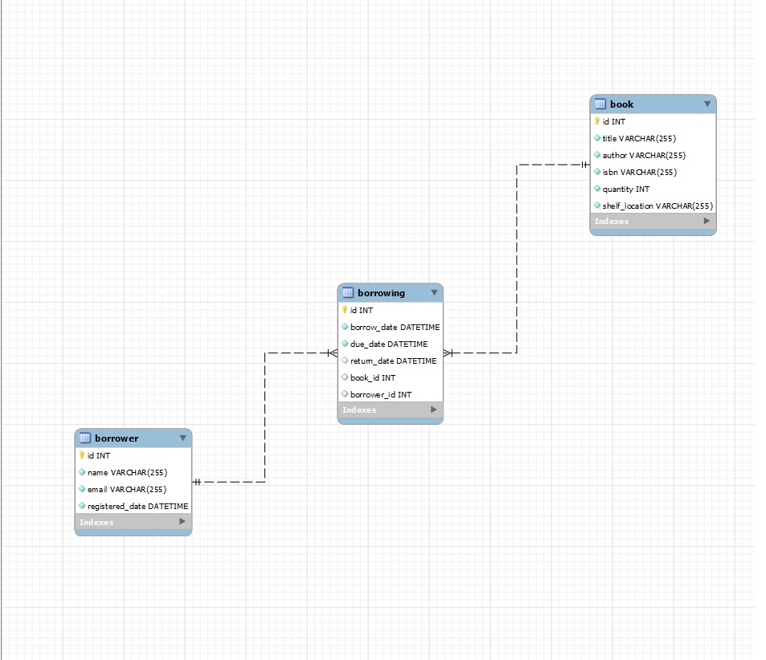

# Library Management System Api

Simple library management system to manage books and borrowers with NodeJs, MySQL, TypeORM and TypeScript with basic jwt auth, rate limiting and swagger documentation.

## Table of Contents

- [Installation](#installation)
- [Usage](#usage)
- [Test](#test)
- [API Endpoints](#api-endpoints)
- [Swagger](#swagger)
- [Authentication](#authentication)
- [Datebase](#database)
- [Improvement](#improvement)


## Installation

```bash
$ npm install
```

## Usage

```bash
# development
$ npm run start

# watch mode
$ npm run start:dev

# production mode
$ npm run start:prod
```
The API will be available at `http://localhost:3000/api`

## Test

```bash
# unit tests for book service
$ npm run test -- --testPathPattern=books.service.spec.ts

# e2e tests
$ npm run test:e2e

# test coverage
$ npm run test:cov
```

## API Endpoints

- **`POST /api/books`**: Create a new book.
- **`GET /api/books`**: Retrieve all books.
- **`GET /api/books/:id`**: Retrieve a specific book.
- **`PUT /api/books/:id`**: Update a book.
- **`DELETE /api/books/:id`**: Delete a book.

- **`POST /api/borrowers`**: Create a new borrower.
- **`GET /api/borrowers`**: Get all borrowers.
- **`GET /api/borrowers/:id`**: Retrieve a specific borrower.
- **`PATCH /api/borrowers/:id`**: Update a borrower.
- **`DELETE /api/borrowers/:id`**: Delete a borrower.

- **`POST /api/borrowings`**: Create a new borrowing record.
- **`GET /api/borrowings`**: Retrieve all borrowing records.
- **`GET /api/borrowings/check/:id`**: Retrieve borrowing records for a specific borrower.
- **`PUT /api/borrowings/return/:bookId/:borrowerId`**: Mark a book as returned.
- **`GET /api/borrowings/overdue`**: Retrieve overdue borrowing records.

- **`GET /api/report/borrowing`**: Generate a borrowing report.
- **`GET /api/report/overdue`**: Export an overdue borrows report.
- **`GET /api/report/all`**: Export a report of all borrowing processes last month.

## Swagger

You can explore and test the API using Swagger documentation.

Swagger UI is available at: [http://localhost:3000/api/](http://localhost:3000/api/)

## Authentication

I implemented 2 hard coded users for basic auth you can use them to test the protected endpoints.

- `username: admin password: admin`
## Database

Creating the tables isn't necessary as the ORM will take care of them once you run the app.

```bash
$ CREATE DATABASE  IF NOT EXISTS library
```
After the ORM creates the the tables you can index title, author and isbn to optimize searching

```bash
$ CREATE INDEX idx_title ON books (title);
$ CREATE INDEX idx_author ON books (author);
$ CREATE INDEX idx_isbn ON books (isbn);

```


## Improvement

This api can be improved by: 

- Using Redis for caching.
- Implementing some pagination in certain endpoints.
- Implementing a full authnetication model with real users not hard coded ones.
- Designing microservices for different functionalities such as the book and the borrower and implementing
a message broker like RabbitMQ for async communication between them to scale better.

